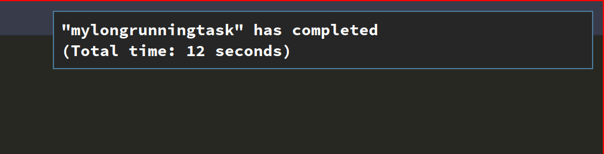

ZSH Auto-Notify
===============

|CircleCI| |Version| |GPLv3|

Simple zsh plugin that automatically sends out a notification when a long running task
has completed.

* Usage_
* Requirements_
* Installation_
* `Temporarily Disabling Notifications`_
* Contributing_
* `Running Tests`_

Usage
-----

You dont need to do anything. Once it's installed,
``zsh-auto-notify`` will let you know if a long running task has completed its work via a
notification in your desktop environment.

Requirements
------------

``auto-notify`` officially supports zsh versions 5.1 onwards.

It is possible the plugin might work on even older versions.
However they would not have been tested as part of the CI test process.

Supported desktop environments:
* Linux X/Wayland (Requires `notify_send` to be installed)
* MacOSX

Installation
------------

Add one of the following to your ``.zshrc`` file depending on your
package manager:

ZPlug_

::

    zplug "MichaelAquilina/zsh-auto-notify"

Antigen_

::

    antigen bundle "MichaelAquilina/zsh-auto-notify"

Zgen_

::

    zgen load "MichaelAquilina/zsh-auto-notify"

oh-my-zsh_

Copy this repository to ``$ZSH_CUSTOM/custom/plugins``, where ``$ZSH_CUSTOM``
is the directory with custom plugins of oh-my-zsh `(read more) <https://github.com/robbyrussell/oh-my-zsh/wiki/Customization/>`_:
::

    git clone https://github.com/MichaelAquilina/zsh-auto-notify.git $ZSH_CUSTOM/plugins/auto-notify

Then add this line to your ``.zshrc``. Make sure it is **before** the line ``source $ZSH/oh-my-zsh.sh``.

::

    plugins=(auto-notify $plugins)

Temporarily Disabling Notifications
-----------------------------------

You can temporarily disable auto notify by running the command ``disable_auto_notify``.

When you want to re-enable notifications, run the command ``enable_auto_notify``.

Contributing
------------

Pull requests and Feedback are welcome! :tada:

I have tried to cater for as many use cases that I can think of.
However, they are naturally tailored to to my own workflow and I could
be missing many others.

Because of this if there is a specific use case that does not work as
you would expect or if you have any suggestions to how the plugin should
behave, feel free to `open an
issue <https://github.com/MichaelAquilina/zsh-auto-notify/issues/new>`__

Running Tests
-------------

Install `zunit <https://zunit.xyz/>`__. Run ``zunit`` in the root
directory of the repo.

::

    $ zunit
    Launching ZUnit
    ZUnit: 0.8.2
    ZSH:   zsh 5.3.1 (x86_64-suse-linux-gnu)

    ✔ ysu message correct output
    ✔ ysu global message correct output
    ✔ ysu git message correct output

NOTE: It is required that you use a minimum zunit version of 0.8.2

NOTE: The tests that run move your git configuration to a temporary
location during the test process so that your user configuration does
not interfere with tests. This will be restored at the end of each test
so there is no risk in losing your settings. If for some strange reason
zunit crashes or does not restore your git configuration automatically,
all you need to do is run ``mv ~/.gitconfig.bak ~/.gitconfig``

.. _Zplug: https://github.com/zplug/zplug

.. _Antigen: https://github.com/zsh-users/antigen

.. _ZGen: https://github.com/tarjoilija/zgen

.. _oh-my-zsh: https://github.com/robbyrussell/oh-my-zsh

.. _Arch Linux: https://www.archlinux.org/

.. _AUR: https://aur.archlinux.org/packages/zsh-auto-notify/

.. |GPLv3| image:: https://img.shields.io/badge/License-GPL%20v3-blue.svg
   :target: https://www.gnu.org/licenses/gpl-3.0

.. |CircleCI| image:: https://circleci.com/gh/MichaelAquilina/zsh-auto-notify.svg?style=svg
   :target: https://circleci.com/gh/MichaelAquilina/zsh-auto-notify

.. |Version| image:: https://badge.fury.io/gh/MichaelAquilina%2Fzsh-auto-notify.svg
   :target: https://badge.fury.io/gh/MichaelAquilina%2Fzsh-auto-notify
